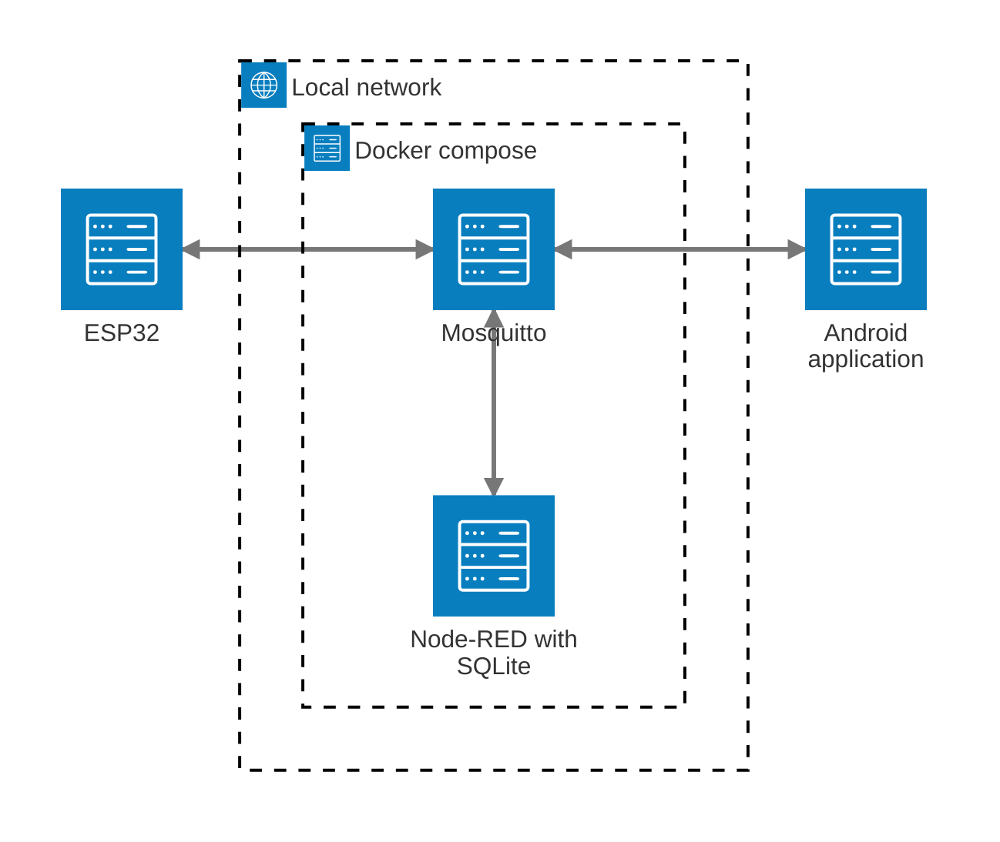

# Infrastructure



The Mosquitto (MQTT broker) and Node-RED are running as a services of a Docker compose on the local machine, and are exposed to the local network through the local IP of the local machine. This connection allows the ESP32 and Android application to communicate with the Mosquitto (MQTT broker) and Node-RED, enabling real-time data exchange and control commands between devices.

## Mosquitto

Mosquitto is a message broker that implements the MQTT protocol, allowing devices to communicate with each other by publishing and subscribing to topics. In this project, Mosquitto is connected to the ESP32 using the MQTT protocol, enabling real-time data exchange and control commands between devices through Node-RED.

> [!TIP]
> If you want to test the MQTT topics, you need to have the [VSMqtt](https://marketplace.visualstudio.com/items?itemName=rpdswtk.vsmqtt) extension installed; It is installed automatically installed if you are in the DevContainer. Then, click in the MQTT icon in the left sidebar of Visual Studio Code to open the MQTT Explorer, where you can connect to the Mosquitto broker and test the topics.

### Topics published by ESP32

| Topic                         | Description                                                                                                                                |
| ----------------------------- | ------------------------------------------------------------------------------------------------------------------------------------------ |
| `:device/health`              | Provides the health status of the device, indicating whether it is online or offline.                                                      |
| `:device/system`              | Provides the current system status of the device, indicating whether it is in virgin mode, stock mode, security mode, or an unknown state. |
| `:device/alarm`               | Provides the status of the alarm system, indicating whether it is muted or playing.                                                        |
| `:device/:shelf/stock`        | Provides the current stock information for a specific shelf.                                                                               |
| `:device/:shelf/security`     | Provides the current security information for a specific shelf, anomaly detection status.                                                  |
| `:device/:shelf/tare/request` | Request the tare offset value for a specific shelf.                                                                                        |
| `:device/:shelf/tare/save`    | Provides the tare offset value for a specific shelf to be saved.                                                                           |

> [!NOTE]
> `:device` is a placeholder for the device identifier (e.g., `corridor-01`), and `:shelf` is a placeholder for the shelf identifier (e.g., `shelf-01`).

#### Examples of output messages

<details>
<summary><code>corridor-01/health</code></summary>

```jsonc
{
  "status": "online" // "online" | "offline"
}
```

</details>

<details>
<summary><code>corridor-01/system</code></summary>

```jsonc
{
  "status": "VIRGIN_EMBEDDED" // "VIRGIN_EMBEDDED" | "STOCK_MODE" | "SECURITY_MODE" | "UNKNOWN_SYSTEM_STATUS"
}
```

</details>

<details>
<summary><code>corridor-01/alarm</code></summary>

```jsonc
{
  "muted": false, // boolean
  "playing": false // boolean
}
```

</details>

<details>
<summary><code>corridor-01/shelf-01/stock</code></summary>

```jsonc
{
  "name": "Apples", // String
  "weight": 1000, // int - Current weight (in grams)
  "weightPerUnit": 0, // int - Weight of a single unit (in grams)
  "stock": 0, // int - Current stock
  "minimumAcceptableStock": 1 // int - Minimum stock threshold
}
```

</details>

<details>
<summary><code>corridor-01/shelf-01/security</code></summary>

```jsonc
{
  "weight": 0, // int - Current weight (in grams)
  "anomaly": false, // boolean - `true` = anomaly detected, `false` = no anomaly
  "baselineWeight": 0 // int - Reference weight (in grams)
}
```

</details>

<details>
<summary><code>corridor-01/shelf-01/tare/request</code></summary>

```jsonc

```

</details>

<details>
<summary><code>corridor-01/shelf-01/tare/save</code></summary>

```jsonc
{
  "offset": 0 // int - Tare offset (in grams)
}
```

</details>

### Topics subscribed by ESP32

| Topic                    | Description                                                                           |
| ------------------------ | ------------------------------------------------------------------------------------- |
| `:device/stock`          | Provides the command to activate or deactivate stock mode on the device.              |
| `:device/security`       | Provides the command to activate or deactivate security mode on the device.           |
| `:device/security/alarm` | Provides the command to mute or unmute the alarm on the device.                       |
| `:device/:shelf/tare`    | Provides the command to set the tare offset value for a specific shelf on the device. |

> `:device` is a placeholder for the device identifier (e.g., `corridor-01`), and `:shelf` is a placeholder for the shelf identifier (e.g., `shelf-01`).

#### Examples of incoming messages

<details>
<summary><code>corridor-01/stock</code></summary>

```jsonc
{
  "status": "ON" // "ON" | "OFF"
}
```

</details>

<details>
<summary><code>corridor-01/security</code></summary>

```jsonc
{
  "status": "ON" // "ON" | "OFF"
}
```

</details>

<details>
<summary><code>corridor-01/security/alarm</code></summary>

```jsonc
{
  "status": "MUTE" // "MUTE" | "UNMUTE"
}
```

</details>

<details>
<summary><code>corridor-01/shelf-01/tare</code></summary>

```jsonc
{
  "offset": 0, // int - Tare offset (in grams)
  "lastUpdate": 0 // int - Timestamp of the last update (in milliseconds elapsed since midnight, January 1, 1970 Universal Coordinated Time [UTC])
}
```

</details>

## Node-RED

Node-RED is a flow-based development tool for visual programming, used to connect and orchestrate various services and devices. In this project, Node-RED serves as the central hub for processing data from the ESP32 and sending commands back to it via MQTT, and vice versa. It also exposes HTTP endpoints that allow external applications, such as the Android app, to interact with the system.

> [!TIP]
> If you want to test the HTTP endpoints, open `infrastructure/endpoints.http` file in Visual Studio Code and click on the `Send Request` button above each request. You need to have the [REST Client](https://marketplace.visualstudio.com/items?itemName=humao.rest-client) extension installed; It is installed automatically installed if you are in the DevContainer.

### HTTP endpoints

| Method | Endpoint                               | Description                                           |
| ------ | -------------------------------------- | ----------------------------------------------------- |
| GET    | `:hostname/api/:device`                |
| POST   | `:hostname/api/:device/stock`          | Activates or deactivates stock mode on the device.    |
| POST   | `:hostname/api/:device/security`       | Activates or deactivates security mode on the device. |
| POST   | `:hostname/api/:device/security/alarm` | Mutes or unmutes the alarm on the device.             |

> `:hostname` is a placeholder for the hostname or IP address of the machine running the Node-RED server (e.g., `localhost`), and `:device` is a placeholder for the device identifier (e.g., `corridor-01`).

#### Examples of responses

<details>
<summary><code>GET http://localhost:1880/api/corridor-01</code></summary>

```jsonc
{
  "health": {
    "status": "online"
  },
  "lastUpdate": 1782670749047,
  "system": {
    "status": "VIRGIN_EMBEDDED"
  },
  "alarm": {
    "muted": false,
    "playing": false
  },
  "shelves": {
    "shelf-01": {
      "stock": {
        "name": "Apples",
        "weight": 0,
        "weightPerUnit": 1000,
        "stock": 0,
        "minimumAcceptableStock": 1
      },
      "security": {
        "weight": 0,
        "anomaly": false,
        "baselineWeight": 0
      },
      "tare": {
        "offset": 0,
        "lastUpdate": 1782670724391
      }
    }
  }
}
```

</details>

#### Examples of requests

<details>
<summary><code>POST http://localhost:1880/api/corridor-01/stock</code></summary>

```jsonc
{
  "status": "ON" // "ON" | "OFF"
}
```

</details>

<details>
<summary><code>POST http://localhost:1880/api/corridor-01/security</code></summary>

```jsonc
{
  "status": "ON" // "ON" | "OFF"
}
```

</details>

<details>
<summary><code>POST http://localhost:1880/api/corridor-01/security/alarm</code></summary>

```jsonc
{
  "status": "MUTE" // "MUTE" | "UNMUTE"
}
```

</details>
